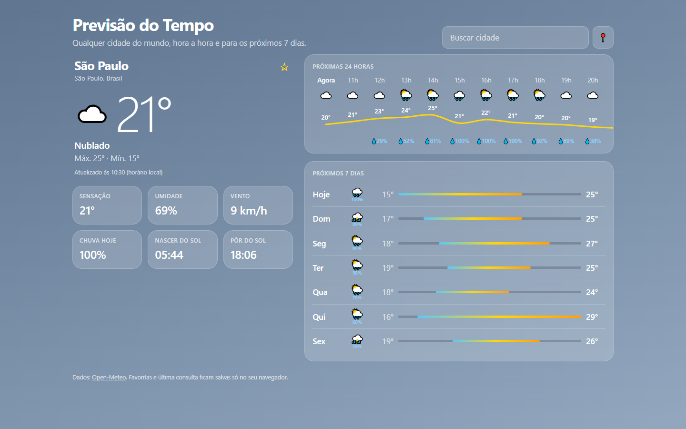

# Previsão do Tempo

Previsão do tempo de qualquer cidade do mundo, hora a hora e para os próximos 7 dias, com visual inspirado no app Tempo do iPhone. Os dados vêm da API aberta da Open-Meteo, sem chave e sem servidor próprio.

**Acesse:** https://gutemberg-vercosa.github.io/previsao-tempo/

<a href="https://gutemberg-vercosa.github.io/previsao-tempo/"></a>

## O que ele faz

- Busca qualquer cidade pelo nome, com sugestões enquanto você digita, ou usa a sua localização.
- Mostra temperatura, sensação térmica, umidade, vento, chance de chuva e horários do nascer e do pôr do sol.
- Desenha a curva de temperatura das próximas 24 horas, com a chance de chuva de cada hora.
- Mostra os próximos 7 dias com a faixa de mínima e máxima de cada dia comparada à da semana.
- Muda as cores do fundo conforme o tempo (sol, nuvens, chuva, neve, trovoada) e a hora do dia.
- Guarda cidades favoritas e a última consulta no navegador. Sem conexão, mostra os últimos dados salvos.

## Como funciona

- `api.ts` busca as cidades e a previsão na Open-Meteo e converte a resposta, que vem em colunas, em listas de horas e de dias, começando na hora atual da cidade.
- `tempo.ts` traduz os códigos de tempo da OMS (WMO) para texto, ícone e tema do fundo, com ícones de noite quando fazem sentido.
- `grafico.ts` gera a curva em SVG sem biblioteca: os pontos são escalados entre a menor e a maior temperatura e ligados por uma curva suave (Catmull-Rom convertida em Bézier).
- A busca espera a pessoa parar de digitar e cancela a requisição anterior com `AbortController`, para uma resposta atrasada não sobrescrever a mais recente.
- Se a previsão não carregar, a última consulta salva é exibida com o horário dos dados.

## Tecnologias

- TypeScript e Vite, sem frameworks.
- Vitest para os testes da conversão dos dados, dos códigos de tempo e do gráfico.
- GitHub Actions roda os testes, gera o build e publica no GitHub Pages a cada push.

## Estrutura

| Arquivo | Responsabilidade |
|---|---|
| `src/api.ts` | Busca de cidades e previsão na Open-Meteo |
| `src/tempo.ts` | Códigos de tempo e faixa de temperatura da semana |
| `src/grafico.ts` | Pontos e curva do gráfico das próximas horas |
| `src/main.ts` | Interface: busca, localização, favoritas e exibição |

## Rodando localmente

```bash
npm install
npm run dev     # servidor de desenvolvimento
npm test        # testes
npm run build   # build de produção em dist/
```

Dados de previsão: [Open-Meteo](https://open-meteo.com) (CC BY 4.0).
